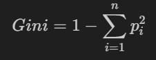

# DecisionTree-GiniIndex: A Python Implementation for Splitting Based on Gini Impurity

Decision trees are a fundamental machine learning algorithm, widely used for classification and regression tasks. A critical step in building decision trees is determining the best split point for each node. This project implements a Python-based solution to calculate the **Gini index impurity**, a measure often used to evaluate the quality of splits in decision trees. By leveraging **NumPy**, this implementation ensures efficient computation while maintaining simplicity and clarity.

## Overview of the Project

This project focuses on identifying the best split point for a dataset by minimizing Gini impurity. It supports binary classification problems and works with both discrete and continuous features. The implementation is particularly useful for understanding how decision tree algorithms select features and thresholds to build their structure.

### Key Features

- **Gini Impurity Calculation**: Computes the Gini impurity for different splits in the dataset.
- **Optimal Split Point Detection**: Identifies the feature and threshold that result in the lowest impurity.
- **Support for Binary Classification**: Designed specifically for datasets with binary target variables.
- **Efficient Computation with NumPy**: Utilizes NumPy for fast array manipulation and calculations.

---

## How It Works

### Step-by-Step Explanation

1. **Input Data**: The script takes a dataset in the form of a NumPy array, where each row represents an observation, and columns represent features and the target variable.

2. **Feature Selection**: It evaluates each feature (column) to determine whether it is discrete or continuous. 
   - For **discrete features**, the script calculates impurity based on unique values.
   - For **continuous features**, it evaluates potential split points between successive values.

3. **Calculate Gini Impurity**: The Gini impurity is computed for each potential split:
\
where  
\
is the proportion of observations belonging to class\
 

4. **Weighted Average Impurity**: For each split, the script calculates a weighted average of the impurities for the two resulting subsets (true side and false side).

5. **Optimal Split Point**: The split point with the lowest weighted impurity is selected as the best threshold for that feature.

6. **Recursive Splitting**: Once the best split is identified, the dataset is divided into subsets, and the process repeats recursively to build the decision tree.

---

## Example Dataset

Here’s an example dataset used in the script:

| Pressure | Diabetes | Age | Stroke |
|----------|----------|-----|--------|
| 1        | 0        | 18  | 1      |
| 1        | 1        | 15  | 1      |
| 0        | 1        | 65  | 0      |
| 0        | 0        | 33  | 0      |
| 1        | 0        | 37  | 1      |

In this dataset:
- Column 1 (`Pressure`), Column 2 (`Diabetes`), and Column 3 (`Age`) are features (X).
- Column 4 (`Stroke`) is the target variable (Y).

---

## Implementation Details

### Code Walkthrough

Here’s an outline of how the code works:

1. **Weighted Average Function**:
   ```python
   def calc_wighted_average(im1, imp1_multiplier, im2, imp2_multiplier):
       return round((((im1 * imp1_multiplier) + (im2 * imp2_multiplier)) / (imp1_multiplier + imp2_multiplier)), 3)
   ```
   This function computes the weighted average of two impurities based on their respective subset sizes.

2. **Impurity Calculation Function**:
   ```python
   def calc_impurity(data):
       # Handles both discrete and continuous features
       if len(np.unique(data[:, 0])) > 2:
           # Continuous feature handling
           ...
       else:
           # Discrete feature handling
           ...
   ```
   This function determines whether a feature is discrete or continuous and calculates Gini impurity accordingly.

3. **Dataset Splitting**:
   After identifying the optimal split point, the dataset is divided into two subsets: one for values below the threshold (`true_side_df`) and one for values above it (`false_side_df`).

4. **Recursive Evaluation**:
   The process repeats for each subset to determine whether additional splits are needed, building out the decision tree structure.

---

## Example Usage

Here’s how you can use this implementation:

```python
import numpy as np
from your_script_name import calc_impurity

# Example dataset
df = np.array([
    [1, 0, 18, 1],
    [1, 1, 15, 1],
    [0, 1, 65, 0],
    [0, 0, 33, 0],
    [1, 0, 37, 1]
])

# Calculate impurity for a specific feature
result = calc_impurity(df[:, [2, -1]])  # Evaluate 'Age' against 'Stroke'
print(result)
```

### Output

The output will display the best split point and its corresponding impurity value. For instance:
```python
{'68.0': 0.3}
```
This indicates that splitting at age `68` results in the lowest impurity.

---

## Installation Instructions

To use this implementation:

1. Clone the repository:
   ```bash
   git clone https://github.com/hesam2801/Gini-Impurity-Calculator.git
   cd DecisionTree-GiniIndex
   ```

2. Install NumPy if it’s not already installed:
   ```bash
   pip install numpy
   ```

---

## Why Use This Implementation?

This project provides a clear and concise implementation of decision tree splitting using Gini impurity. It’s an excellent resource for:
- Understanding how decision trees work.
- Learning about feature selection and threshold determination.
- Experimenting with binary classification problems.

---

## Contributions

Contributions are welcome! If you’d like to improve or extend this project, feel free to fork the repository and submit a pull request.

---

## License

This project is licensed under the MIT License. Feel free to use it in your own projects!

---

By following this guide, you’ll gain a deeper understanding of decision trees and how Gini impurity is used to build them step by step. Happy coding! 🚀

